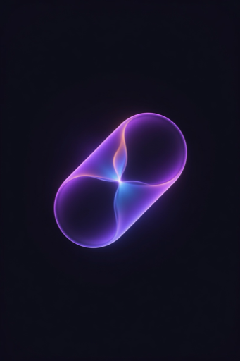

<div align="center">



# flare_toast

**Premium toast notifications for Flutter — Dynamic Island inspired, zero dependencies.**

[](https://pub.dev/packages/flare_toast)
[](https://pub.dev/packages/flare_toast/score)
[](https://pub.dev/packages/flare_toast)
[](https://pub.dev/packages/flare_toast)
[](https://opensource.org/licenses/MIT)

Part of the **Flare** premium UI ecosystem by [ErsanQ](https://github.com/ErsanQ).

</div>

---

## ✨ Demo

> **GIF description:** The demo GIF shows a dark-themed Flutter app. When the user taps "Show Toast", a pill-shaped notification smoothly bounces into view from the top of the screen with a fluid elastic/spring animation. It displays a green check-mark icon on the left, followed by white bold text reading "Action completed!". After two seconds it gracefully fades out while sliding slightly upward, leaving the screen clean. The whole sequence takes roughly 2.8 s end-to-end.

<div align="center">
  
</div>

---

## 🚀 Features

| Feature | Description |
|---|---|
| 🌊 **Elastic entrance** | Spring-physics bounce powered by `ElasticOutCurve` |
| 💨 **Smooth exit** | Fade + upward slide — feels butter-smooth |
| 🏝 **Dynamic Island feel** | Pill-shaped, top-center, SafeArea-aware |
| 🎨 **Full customization** | Colors, icon, radius, duration, text style |
| 🧩 **Zero dependencies** | Pure Flutter SDK — no bloat |
| 🌐 **Global API** | `FlareToast.show()` from anywhere |
| ⚙️ **Advanced control** | `FlareToastController` for manual dismiss |
| 📖 **100 % documented** | DartDoc on every public symbol |
| ✅ **Lint-clean** | `flutter_lints ^3.0.0` — zero warnings |

---

## 📦 Installation

Add `flare_toast` to your `pubspec.yaml`:

```yaml
dependencies:
  flare_toast: ^1.0.0
```

Then run:

```bash
flutter pub get
```

---

## 🛠 Setup

Wrap your application by using the `builder` parameter of `MaterialApp` (or `CupertinoApp`) to inject `FlareToastWrapper`:

```dart
import 'package:flare_toast/flare_toast.dart';
import 'package:flutter/material.dart';

void main() {
  runApp(const MyApp());
}

class MyApp extends StatelessWidget {
  const MyApp({super.key});

  @override
  Widget build(BuildContext context) {
    return MaterialApp(
      title: 'My App',
      // Inject the toast wrapper here:
      builder: (context, child) => FlareToastWrapper(child: child!),
      home: const HomePage(),
    );
  }
}
```

> **Why use `builder`?**  
> `FlareToastWrapper` injects a root `Overlay` for the toasts to float above dialogs and bottom sheets. By placing it inside `MaterialApp.builder`, we ensure that necessary infrastructure like `Directionality` and `MediaQuery` are already present in the widget tree.

---

## 💡 Usage

### Basic Toast

```dart
FlareToast.show(context, message: 'Hello, Flare! 🔥');
```

### With Icon

```dart
FlareToast.show(
  context,
  message: 'File saved successfully',
  icon: const Icon(Icons.check_circle_rounded, color: Colors.greenAccent, size: 20),
);
```

### Custom Colors & Radius

```dart
FlareToast.show(
  context,
  message: 'Something went wrong',
  icon: const Icon(Icons.error_outline_rounded, color: Colors.redAccent, size: 20),
  backgroundColor: const Color(0xFF1C1C1E),
  textColor: Colors.white,
  borderRadius: 16,
);
```

### Custom Duration & Text Style

```dart
FlareToast.show(
  context,
  message: 'Long-running task finished!',
  duration: const Duration(seconds: 4),
  textStyle: const TextStyle(
    fontWeight: FontWeight.w700,
    fontSize: 15,
    letterSpacing: 0.3,
  ),
);
```

### Manual Dismiss with Controller

```dart
final controller = FlareToastController();

FlareToast.showWithController(
  context,
  message: 'Processing…',
  icon: const CircularProgressIndicator(strokeWidth: 2, color: Colors.white),
  controller: controller,
  duration: Duration.zero, // won't auto-dismiss
);

// Later:
controller.dismiss();
```

---

## 📚 API Reference

### `FlareToast`

The main entry-point class.

#### `FlareToast.show()`

```dart
static void show(
  BuildContext context, {
  required String message,
  Widget? icon,
  Color? backgroundColor,
  Color? textColor,
  double borderRadius = 50,
  Duration duration = const Duration(seconds: 2),
  Duration animationDuration = const Duration(milliseconds: 600),
  TextStyle? textStyle,
})
```

| Parameter | Type | Default | Description |
|---|---|---|---|
| `context` | `BuildContext` | — | A valid `BuildContext` inside the widget tree. |
| `message` | `String` | — | The text displayed in the toast. |
| `icon` | `Widget?` | `null` | Optional widget rendered to the left of the message. |
| `backgroundColor` | `Color?` | `Color(0xFF1C1C1E)` | Toast background color. |
| `textColor` | `Color?` | `Colors.white` | Message text color. |
| `borderRadius` | `double` | `50` | Corner radius (50 produces a pill shape). |
| `duration` | `Duration` | `Duration(seconds: 2)` | How long the toast stays visible. Pass `Duration.zero` for a persistent toast. |
| `animationDuration` | `Duration` | `Duration(milliseconds: 600)` | Length of the entrance animation. |
| `textStyle` | `TextStyle?` | `null` | Fully overrides the default text style when provided. |

#### `FlareToast.showWithController()`

Same parameters as `show()`, plus:

| Parameter | Type | Description |
|---|---|---|
| `controller` | `FlareToastController` | Exposes a `dismiss()` method for manual dismissal. |

---

### `FlareToastWrapper`

```dart
FlareToastWrapper({required Widget child})
```

A thin wrapper that injects the `Overlay` needed by `FlareToast`. Place it inside the `builder` of your `MaterialApp` / `CupertinoApp`.

---

### `FlareToastController`

```dart
final controller = FlareToastController();
controller.dismiss(); // programmatically dismiss the toast
```

---

### `FlareToastPosition` (enum)

```dart
enum FlareToastPosition { top, bottom }
```

> **Note:** `bottom` positioning is on the roadmap and will be available in v1.1.0.

---

## 🎨 Design Philosophy

`flare_toast` is inspired by Apple's **Dynamic Island** — a compact, pill-shaped notification surface that feels native without being intrusive. The elastic entrance mimics real-world spring physics, making the UI feel alive. The fade-out respects the user's attention by disappearing gracefully rather than snapping away.

---

## 🗺 Roadmap

- [ ] Bottom positioning (`FlareToastPosition.bottom`)
- [ ] Queue support (multiple toasts in sequence)
- [ ] Haptic feedback integration
- [ ] Cupertino / iOS-native theme preset
- [ ] RTL layout support

---

## 🤝 Contributing

Contributions are welcome! Please open an issue first to discuss what you'd like to change.

1. Fork the repository
2. Create your feature branch (`git checkout -b feature/my-feature`)
3. Run `flutter analyze` and `flutter test` — must pass with zero warnings
4. Open a Pull Request

---

## 📄 License

This project is licensed under the **MIT License** — see the [LICENSE](LICENSE) file for details.

---

<div align="center">
  Made with ❤️ by <a href="https://github.com/ErsanQ">ErsanQ</a> · Part of the <strong>Flare</strong> UI ecosystem
</div>
